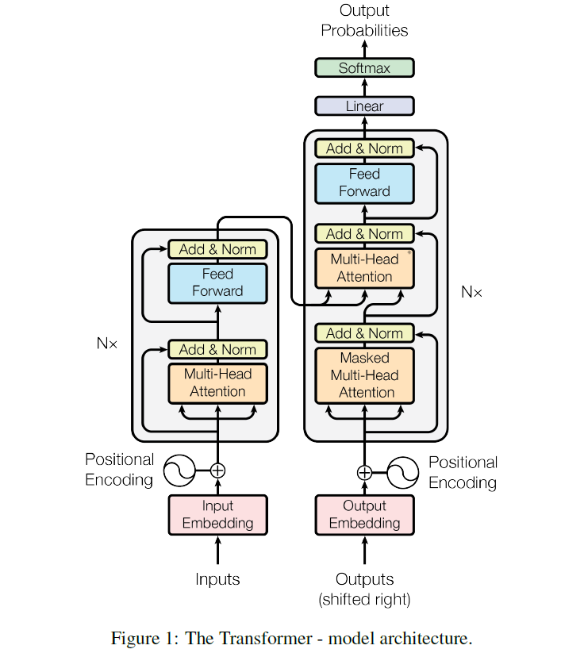

# 1 Transformer模型

在斯坦福的阅读理解数据集中 机器表现已经超过人类表现（Bert+DAE+AOA）

来源于谷歌在2017年发表的Attention is all your need

## 1.1 一般的NLP项目流程

上游任务：预训练语言模型

下游任务：分类、翻译等具体任务

## 1.2 理论部分-transformer

首先理解编码器。那么解码器就比较好理解，下面展示编码器的计算流程图



### 1.2.1 模型结构

上述结构分为编码器和解码器（encoder和decoder）

encoder：包含一系列相同但独立的单元，每个单元含有两种子结构：1-多头注意力模块，2-全连接层和残差连接以及LayerNorm

每一个子层的结构都为LayerNorm(x+sublayer(x))，其中sublayer是每一个子层的输出

decoder：和encoder类似，都有一样的子结构，但是不一样的是，他还有第三种子结构使得output的多头attention加入到encoder的结果中。每一层都会使用残差链接及LayerNorm。在output的mebedding中使用了遮罩（mask），确保i位置的输出仅仅依赖于其前面位置的输出

### 1.2.2 Attention部分说明

attention函数可以被看作一系列的query和一组key-value对的相互作用产生的输出output。其中query、key、value、output都是vector。output就是一组values的权重加和，这个权重就由query和它对应的key相计算得出的

#### 1.2.2.1 Scaled Dot-Product Attention


输入包括一组query、keys、values，其中query和key的维度必须一致$d_k$，values则可以不一致$d_v$

- query与key进行点乘
- 点乘之后需要进行尺度变换，将结果除以$\sqrt{d_k}$。进行尺度变换的原因在于，假设原来的数据服从N(0,1)的正态分布，点乘之后，数据就变为了一个N(0,$d_k$)的正态分布，需要将其变换到原来的分布上
- 尺度变换之后，需要将其进行softmax变换
- 然后再乘以value，公式：$Attention(Q,K,V)=softmax(\frac{QK^T}{\sqrt{d_k}})V$
- 在实际应用中，我们会同时并行处理多个QKV，会将其打包至矩阵中，利用矩阵变换进行计算

#### 1.2.2.2 Multi-Head Attention

$MultiHead(Q,K,V)=Concat(head_1,head_2,...,head_h)W^o$

其中$head_i=Attention(QW_{i}^{Q},kW_{i}^{k},VW_{i}^{V})$

### 1.2.3 为什么使用self-attention

1. 每层的计算复杂度
2. 可并行化
3. 网络中长期依赖问题，学习到长期依赖对每一种序列模型都是一个挑战性任务

1. 位置编码 positional encoding

   将每个字的位置信息给模型，才能识别出语言中的顺序信息，编码的维度和字符嵌入的维度一致，可以在编码后直接追加在字符嵌入之上。

   编码信息采用的是两个函数的处理：$sin$和$cos$函数，利用这两个函数对每一个位置的字符进行每一个维度上的编码，以此序列的位置会得到一个唯一的信息；两个函数得到的结果会随着维度的增加产生周期性变化，变化速度会变得越来越慢，从而模型在这个变化的信息中学习到每一个字符的时序特性。

   假设输入的字符长度为(0,sequence_length),pos表示其在长度中的位置索引，$d_{model}$是编码维度，i是向量的某一维的一半，比如$d_{model}=512,i=0,1,...,255$

   $$PE_{(pos,2i)}=sin(pos/10000^{2i/d_{model}})$$

   $$PE_{(pos,2i+1)}=cos(pos/10000^{2i /d_{model}})$$

    根据如上公式，可以为每个位置上的token生成$d_{model}$维的位置向量 

2. multi-head-attention

   自注意力机制

3. 残差连接和Layer Norm

4. Feed Forward 和 Add Norm

# 2 BERT

全程：Bidirectional Encoder Representations from Transformers.

利用Transformer的双向编码表示

一般有两种利用预训练模型的方式：

- feature-based 直接利用网络结构构建新的特征 （ELMo）
- fine-tuning 提供最小的参数集，在下游任务中自己训练微调更新（GPT、BERT）

BERT是双向表示

## 2.1 任务目标

- MLM（Masked language model）遮盖语言模型，随机遮盖输入中的某些词语，预测其原有的词语
- Next Sentence prediction 该任务训练句子对的表示 

## 2.2 模型结构

### 2.2.1 输入介绍

- 定义$L$为层数
- 隐含层大小为$H$
- 自注意力机制的heads大小为$A$
- $Bert_{base}(L=12,H=768,A=12,ParamNums=110M)$
- $Bert_{large}(L=24,H=1024,A=16,ParamNums=340M)$
- 英文单词在处理中需要利用wordpiece来处理，划分成了30000个词典
- 每一个序列的第一个token是[CLS]，在最后的隐含层里会连接上这个CLS-token，它被用来代表这一序列的聚合表示
- 句子对被打包在一起形成单独的句子，我们用两种方式区分这些句子
  1. 我们用特殊字符[SEP]来进行分隔
  2. 我们增加了一个特殊的嵌入层来指示句子中的token属于A句还是B句
- 由此，对于每一个token，他的输入表示由token的嵌入，分隔的嵌入，以及位置的嵌入进行加和表示


### 2.2.2 预训练Bert模型

#### 2.2.2.1 Masked LM


## Google源代码学习

Github: https://github.com/google-research/bert 

### 1 modeling.py

```python
# 直接在代码中注释说明
# 首先看下transformer的结构
# 此处输入数据为经过了embedding和位置编码的数据
def transformer_model(input_tensor,
                      attention_mask=None,
                      hidden_size=768,
                      num_hidden_layers=12,
                      num_attention_heads=12,
                      intermediate_size=3072,
                      intermediate_act_fn=gelu,
                      hidden_dropout_prob=0.1,
                      attention_probs_dropout_prob=0.1,
                      initializer_range=0.02,
                      do_return_all_layers=False):
  """Multi-headed, multi-layer Transformer from "Attention is All You Need".
  This is almost an exact implementation of the original Transformer encoder.
  See the original paper:  论文地址
  https://arxiv.org/abs/1706.03762
  Also see: tf中的实现，代码很长
  https://github.com/tensorflow/tensor2tensor/blob/master/tensor2tensor/models/transformer.py
  参数说明
  Args:
    input_tensor: float Tensor of shape [batch_size, seq_length, hidden_size]. 
      输入数据
    attention_mask: (optional) int32 Tensor of shape [batch_size, seq_length,
      seq_length], with 1 for positions that can be attended to and 0 in
      positions that should not be. 
      可选的mask层，输入的是一个tensor，当其中元素为1 表示可参与计算，为0则相反
    hidden_size: int. Hidden size of the Transformer.
      隐藏层大小
    num_hidden_layers: int. Number of layers (blocks) in the Transformer.
      隐层的数量
    num_attention_heads: int. Number of attention heads in the Transformer.
      多头的数量
    intermediate_size: int. The size of the "intermediate" (a.k.a., feed
      forward) layer.
      前馈网络的层数
    intermediate_act_fn: function. The non-linear activation function to apply
      to the output of the intermediate/feed-forward layer.
      前馈网络激活函数
    hidden_dropout_prob: float. Dropout probability for the hidden layers.
      隐层的dropout值
    attention_probs_dropout_prob: float. Dropout probability of the attention
      probabilities.
      attention的dropout概率
    initializer_range: float. Range of the initializer (stddev of truncated
      normal).
      初始化权重
    do_return_all_layers: Whether to also return all layers or just the final
      layer.
      返回所有层还是只返回最后一层

  Returns:
    float Tensor of shape [batch_size, seq_length, hidden_size], the final
    hidden layer of the Transformer.

  Raises:
    ValueError: A Tensor shape or parameter is invalid.
  """
  # 隐层数量能必须整除多头个数（在继续宁多头分解时 得到大小一致的attention-head-size）
  if hidden_size % num_attention_heads != 0:
    raise ValueError(
        "The hidden size (%d) is not a multiple of the number of attention "
        "heads (%d)" % (hidden_size, num_attention_heads))
  # 得到attention-head-size
  attention_head_size = int(hidden_size / num_attention_heads)
  # 获取tensor的各个维度的大小
  input_shape = get_shape_list(input_tensor, expected_rank=3)
  batch_size = input_shape[0] # 批次大小
  seq_length = input_shape[1] # 序列长度
  input_width = input_shape[2] # 输入维度

  # The Transformer performs sum residuals on all layers so the input needs
  # to be the same as the hidden size.
  # 利用了残差处理，所以输入的维度数 必须和隐层大小一致，否则不能想加 
  if input_width != hidden_size:
    raise ValueError("The width of the input tensor (%d) != hidden size (%d)" %
                     (input_width, hidden_size))

  # We keep the representation as a 2D tensor to avoid re-shaping it back and
  # forth from a 3D tensor to a 2D tensor. Re-shapes are normally free on
  # the GPU/CPU but may not be free on the TPU, so we want to minimize them to
  # help the optimizer.
  # 此处应是一个小技巧，将输入数据转化问2维的矩阵，为了更好的优化
  prev_output = reshape_to_matrix(input_tensor)
  # 得到所有的隐层
  all_layer_outputs = []
  for layer_idx in range(num_hidden_layers):
    # 第n个layer实现
    with tf.variable_scope("layer_%d" % layer_idx): 
      layer_input = prev_output
      # 1.得到attention层
      with tf.variable_scope("attention"):
        attention_heads = []
        with tf.variable_scope("self"):
          # attention层 后面说明
          attention_head = attention_layer(
              from_tensor=layer_input,
              to_tensor=layer_input,
              attention_mask=attention_mask,
              num_attention_heads=num_attention_heads,
              size_per_head=attention_head_size,
              attention_probs_dropout_prob=attention_probs_dropout_prob,
              initializer_range=initializer_range,
              do_return_2d_tensor=True,
              batch_size=batch_size,
              from_seq_length=seq_length,
              to_seq_length=seq_length)
          attention_heads.append(attention_head)

        attention_output = None
        # 合并得到的多个attention
        if len(attention_heads) == 1:
          attention_output = attention_heads[0]
        else:
          # In the case where we have other sequences, we just concatenate
          # them to the self-attention head before the projection.
          attention_output = tf.concat(attention_heads, axis=-1)

        # Run a linear projection of `hidden_size` then add a residual
        # with `layer_input`.
        # 2.增加残差和layer-norm
        with tf.variable_scope("output"):
          attention_output = tf.layers.dense(
              attention_output,
              hidden_size,
              kernel_initializer=create_initializer(initializer_range))
          attention_output = dropout(attention_output, hidden_dropout_prob)
          attention_output = layer_norm(attention_output + layer_input)
      # 将激活函数用在中间层
      # The activation is only applied to the "intermediate" hidden layer.
      with tf.variable_scope("intermediate"):
        intermediate_output = tf.layers.dense(
            attention_output,
            intermediate_size,
            activation=intermediate_act_fn,
            kernel_initializer=create_initializer(initializer_range))
      # 3.最后再将输出降维到hidden-size大小并增加残差
      # Down-project back to `hidden_size` then add the residual.
      with tf.variable_scope("output"):
        layer_output = tf.layers.dense(
            intermediate_output,
            hidden_size,
            kernel_initializer=create_initializer(initializer_range))
        layer_output = dropout(layer_output, hidden_dropout_prob)
        layer_output = layer_norm(layer_output + attention_output)
        prev_output = layer_output
        # 这样就完成了一次运算，加入到所有输出中
        all_layer_outputs.append(layer_output)

  if do_return_all_layers:
    final_outputs = []
    for layer_output in all_layer_outputs:
      # 将所有的输出再映射回原始数据的大小 
      final_output = reshape_from_matrix(layer_output, input_shape)
      final_outputs.append(final_output)
    return final_outputs
  else:
    # 将所有的输出再映射回原始数据的大小
    final_output = reshape_from_matrix(prev_output, input_shape)
    return final_output

# 接下来说明下attention
def attention_layer(from_tensor,
                    to_tensor,
                    attention_mask=None,
                    num_attention_heads=1,
                    size_per_head=512,
                    query_act=None,
                    key_act=None,
                    value_act=None,
                    attention_probs_dropout_prob=0.0,
                    initializer_range=0.02,
                    do_return_2d_tensor=False,
                    batch_size=None,
                    from_seq_length=None,
                    to_seq_length=None):
  """Performs multi-headed attention from `from_tensor` to `to_tensor`.
  多头的注意力机制
  This is an implementation of multi-headed attention based on "Attention
  is all you Need". If `from_tensor` and `to_tensor` are the same, then
  this is self-attention. Each timestep in `from_tensor` attends to the
  corresponding sequence in `to_tensor`, and returns a fixed-with vector.
  
  This function first projects `from_tensor` into a "query" tensor and
  `to_tensor` into "key" and "value" tensors. These are (effectively) a list
  of tensors of length `num_attention_heads`, where each tensor is of shape
  [batch_size, seq_length, size_per_head].

  Then, the query and key tensors are dot-producted and scaled. These are
  softmaxed to obtain attention probabilities. The value tensors are then
  interpolated by these probabilities, then concatenated back to a single
  tensor and returned.
  # 实际运算中 多头注意力机制经常通过转置和reshape 而不是通过分割来实现
  In practice, the multi-headed attention are done with transposes and
  reshapes rather than actual separate tensors.
  
  Args:
    from_tensor: float Tensor of shape [batch_size, from_seq_length,
      from_width].
    to_tensor: float Tensor of shape [batch_size, to_seq_length, to_width].
    attention_mask: (optional) int32 Tensor of shape [batch_size,
      from_seq_length, to_seq_length]. The values should be 1 or 0. The
      attention scores will effectively be set to -infinity for any positions in
      the mask that are 0, and will be unchanged for positions that are 1.
    num_attention_heads: int. Number of attention heads.
    size_per_head: int. Size of each attention head.
    query_act: (optional) Activation function for the query transform.
    key_act: (optional) Activation function for the key transform.
    value_act: (optional) Activation function for the value transform.
    attention_probs_dropout_prob: (optional) float. Dropout probability of the
      attention probabilities.
    initializer_range: float. Range of the weight initializer.
    do_return_2d_tensor: bool. If True, the output will be of shape [batch_size
      * from_seq_length, num_attention_heads * size_per_head]. If False, the
      output will be of shape [batch_size, from_seq_length, num_attention_heads
      * size_per_head].
    batch_size: (Optional) int. If the input is 2D, this might be the batch size
      of the 3D version of the `from_tensor` and `to_tensor`.
    from_seq_length: (Optional) If the input is 2D, this might be the seq length
      of the 3D version of the `from_tensor`.
    to_seq_length: (Optional) If the input is 2D, this might be the seq length
      of the 3D version of the `to_tensor`.

  Returns:
    float Tensor of shape [batch_size, from_seq_length,
      num_attention_heads * size_per_head]. (If `do_return_2d_tensor` is
      true, this will be of shape [batch_size * from_seq_length,
      num_attention_heads * size_per_head]).

  Raises:
    ValueError: Any of the arguments or tensor shapes are invalid.
  """
  # 转置数据
  def transpose_for_scores(input_tensor, batch_size, num_attention_heads,
                           seq_length, width):
    output_tensor = tf.reshape(
        input_tensor, [batch_size, seq_length, num_attention_heads, width])

    output_tensor = tf.transpose(output_tensor, [0, 2, 1, 3])
    return output_tensor
  
  from_shape = get_shape_list(from_tensor, expected_rank=[2, 3])
  to_shape = get_shape_list(to_tensor, expected_rank=[2, 3])

  if len(from_shape) != len(to_shape):
    raise ValueError(
        "The rank of `from_tensor` must match the rank of `to_tensor`.")

  if len(from_shape) == 3:
    batch_size = from_shape[0]
    from_seq_length = from_shape[1]
    to_seq_length = to_shape[1]
  elif len(from_shape) == 2:
    if (batch_size is None or from_seq_length is None or to_seq_length is None):
      raise ValueError(
          "When passing in rank 2 tensors to attention_layer, the values "
          "for `batch_size`, `from_seq_length`, and `to_seq_length` "
          "must all be specified.")

  # Scalar dimensions referenced here:
  #   B = batch size (number of sequences)
  #   F = `from_tensor` sequence length
  #   T = `to_tensor` sequence length
  #   N = `num_attention_heads`
  #   H = `size_per_head`
  # 转换为2维矩阵
  from_tensor_2d = reshape_to_matrix(from_tensor)
  to_tensor_2d = reshape_to_matrix(to_tensor)

  # `query_layer` = [B*F, N*H] Q
  query_layer = tf.layers.dense(
      from_tensor_2d,
      num_attention_heads * size_per_head,
      activation=query_act,
      name="query",
      kernel_initializer=create_initializer(initializer_range))

  # `key_layer` = [B*T, N*H] K
  key_layer = tf.layers.dense(
      to_tensor_2d,
      num_attention_heads * size_per_head,
      activation=key_act,
      name="key",
      kernel_initializer=create_initializer(initializer_range))

  # `value_layer` = [B*T, N*H] V
  value_layer = tf.layers.dense(
      to_tensor_2d,
      num_attention_heads * size_per_head,
      activation=value_act,
      name="value",
      kernel_initializer=create_initializer(initializer_range))

  # `query_layer` = [B, N, F, H]
  query_layer = transpose_for_scores(query_layer, batch_size,
                                     num_attention_heads, from_seq_length,
                                     size_per_head)

  # `key_layer` = [B, N, T, H]
  key_layer = transpose_for_scores(key_layer, batch_size, num_attention_heads,
                                   to_seq_length, size_per_head)

  # Take the dot product between "query" and "key" to get the raw
  # attention scores.
  # `attention_scores` = [B, N, F, T]
  attention_scores = tf.matmul(query_layer, key_layer, transpose_b=True)
  # 除以sqrt(head_size) 防止点乘之后 数据范围的扩大
  attention_scores = tf.multiply(attention_scores,
                                 1.0 / math.sqrt(float(size_per_head)))

  if attention_mask is not None:
    # `attention_mask` = [B, 1, F, T]
    attention_mask = tf.expand_dims(attention_mask, axis=[1])

    # Since attention_mask is 1.0 for positions we want to attend and 0.0 for
    # masked positions, this operation will create a tensor which is 0.0 for
    # positions we want to attend and -10000.0 for masked positions.
    # 对于有数据的地方变为0，mask的地方为一个很大的负数，这样在做softmax时，使其exp值为0，不影响结果
    adder = (1.0 - tf.cast(attention_mask, tf.float32)) * -10000.0

    # Since we are adding it to the raw scores before the softmax, this is
    # effectively the same as removing these entirely.
    attention_scores += adder

  # Normalize the attention scores to probabilities.
  # `attention_probs` = [B, N, F, T]
  # 按列 做softmax，每一行的值和为1
  attention_probs = tf.nn.softmax(attention_scores)

  # This is actually dropping out entire tokens to attend to, which might
  # seem a bit unusual, but is taken from the original Transformer paper.
  attention_probs = dropout(attention_probs, attention_probs_dropout_prob)
  
  # `value_layer` = [B, T, N, H]
  value_layer = tf.reshape(
      value_layer,
      [batch_size, to_seq_length, num_attention_heads, size_per_head])

  # `value_layer` = [B, N, T, H]
  value_layer = tf.transpose(value_layer, [0, 2, 1, 3])
  # 乘以value，得到最后输出的结果
  # `context_layer` = [B, N, F, H]
  context_layer = tf.matmul(attention_probs, value_layer)

  # `context_layer` = [B, F, N, H]
  context_layer = tf.transpose(context_layer, [0, 2, 1, 3])
  # 返回2维
  if do_return_2d_tensor:
    # `context_layer` = [B*F, N*H]
    context_layer = tf.reshape(
        context_layer,
        [batch_size * from_seq_length, num_attention_heads * size_per_head])
  else:
    # 返回3维
    # `context_layer` = [B, F, N*H]
    context_layer = tf.reshape(
        context_layer,
        [batch_size, from_seq_length, num_attention_heads * size_per_head])

  return context_layer
```

```python
def get_shape_list(tensor, expected_rank=None, name=None):
  """Returns a list of the shape of tensor, preferring static dimensions.
  获取tensor的维度数列表
  Args:
    tensor: A tf.Tensor object to find the shape of.
    expected_rank: (optional) int. The expected rank of `tensor`. If this is
      specified and the `tensor` has a different rank, and exception will be
      thrown.
    name: Optional name of the tensor for the error message.

  Returns:
    A list of dimensions of the shape of tensor. All static dimensions will
    be returned as python integers, and dynamic dimensions will be returned
    as tf.Tensor scalars.
  """
  if name is None:
    name = tensor.name

  if expected_rank is not None:
    assert_rank(tensor, expected_rank, name)

  shape = tensor.shape.as_list()

  non_static_indexes = []
  for (index, dim) in enumerate(shape):
    if dim is None:
      non_static_indexes.append(index)

  if not non_static_indexes:
    return shape

  dyn_shape = tf.shape(tensor)
  for index in non_static_indexes:
    shape[index] = dyn_shape[index]
  return shape
# 验证维度是否一致
def assert_rank(tensor, expected_rank, name=None):
  """Raises an exception if the tensor rank is not of the expected rank.

  Args:
    tensor: A tf.Tensor to check the rank of.
    expected_rank: Python integer or list of integers, expected rank.
    name: Optional name of the tensor for the error message.

  Raises:
    ValueError: If the expected shape doesn't match the actual shape.
  """
  if name is None:
    name = tensor.name

  expected_rank_dict = {}
  if isinstance(expected_rank, six.integer_types):
    expected_rank_dict[expected_rank] = True
  else:
    for x in expected_rank:
      expected_rank_dict[x] = True

  actual_rank = tensor.shape.ndims
  if actual_rank not in expected_rank_dict:
    scope_name = tf.get_variable_scope().name
    raise ValueError(
        "For the tensor `%s` in scope `%s`, the actual rank "
        "`%d` (shape = %s) is not equal to the expected rank `%s`" %
        (name, scope_name, actual_rank, str(tensor.shape), str(expected_rank)))

# 层标准化
def layer_norm(input_tensor, name=None):
  """Run layer normalization on the last dimension of the tensor."""
  return tf.contrib.layers.layer_norm(
      inputs=input_tensor, begin_norm_axis=-1, begin_params_axis=-1, scope=name)

# 层标准化与dropout
def layer_norm_and_dropout(input_tensor, dropout_prob, name=None):
  """Runs layer normalization followed by dropout."""
  output_tensor = layer_norm(input_tensor, name)
  output_tensor = dropout(output_tensor, dropout_prob)
  return output_tensor

# dropout层
def dropout(input_tensor, dropout_prob):
  """Perform dropout.

  Args:
    input_tensor: float Tensor.
    dropout_prob: Python float. The probability of dropping out a value (NOT of
      *keeping* a dimension as in `tf.nn.dropout`).

  Returns:
    A version of `input_tensor` with dropout applied.
  """
  if dropout_prob is None or dropout_prob == 0.0:
    return input_tensor

  output = tf.nn.dropout(input_tensor, 1.0 - dropout_prob)
  return output
```

```python
def create_initializer(initializer_range=0.02):
  """Creates a `truncated_normal_initializer` with the given range."""
  # 返回截断的高斯初始化参数
  return tf.truncated_normal_initializer(stddev=initializer_range)

# 嵌入查表函数
def embedding_lookup(input_ids,
                     vocab_size,
                     embedding_size=128,
                     initializer_range=0.02,
                     word_embedding_name="word_embeddings",
                     use_one_hot_embeddings=False):
  """Looks up words embeddings for id tensor.

  Args:
    input_ids: int32 Tensor of shape [batch_size, seq_length] containing word
      ids.
    vocab_size: int. Size of the embedding vocabulary.
    embedding_size: int. Width of the word embeddings.
    initializer_range: float. Embedding initialization range.
    word_embedding_name: string. Name of the embedding table.
    use_one_hot_embeddings: bool. If True, use one-hot method for word
      embeddings. If False, use `tf.gather()`.

  Returns:
    float Tensor of shape [batch_size, seq_length, embedding_size].
  """
  # This function assumes that the input is of shape [batch_size, seq_length,
  # num_inputs].
  #
  # If the input is a 2D tensor of shape [batch_size, seq_length], we
  # reshape to [batch_size, seq_length, 1].
  if input_ids.shape.ndims == 2:
    input_ids = tf.expand_dims(input_ids, axis=[-1])
  # 获取图上名为“word_embbedding_name”的参数
  embedding_table = tf.get_variable(
      name=word_embedding_name,
      shape=[vocab_size, embedding_size],
      initializer=create_initializer(initializer_range))

  flat_input_ids = tf.reshape(input_ids, [-1])
  # 如果是one_hot形式
  if use_one_hot_embeddings:
    one_hot_input_ids = tf.one_hot(flat_input_ids, depth=vocab_size)
    output = tf.matmul(one_hot_input_ids, embedding_table)
  else:
    # 根据索引值，返回切片数值
    output = tf.gather(embedding_table, flat_input_ids)

  input_shape = get_shape_list(input_ids)
  # 返回与输入一致的大小
  output = tf.reshape(output,
                      input_shape[0:-1] + [input_shape[-1] * embedding_size])
  return (output, embedding_table)
```

```python
def gelu(x):
  """Gaussian Error Linear Unit.
  高斯误差线性单元
  This is a smoother version of the RELU.
  Original paper: https://arxiv.org/abs/1606.08415
  Args:
    x: float Tensor to perform activation.
  某些任务比relu优越
  relu：凸 单调递增 无曲率
  gelu：非凸 非单调递增 有曲率
  Returns:
    `x` with the GELU activation applied.
  """
  cdf = 0.5 * (1.0 + tf.tanh(
      (np.sqrt(2 / np.pi) * (x + 0.044715 * tf.pow(x, 3)))))
  return x * cdf

# 通过字符串获取激活函数
def get_activation(activation_string):
  """Maps a string to a Python function, e.g., "relu" => `tf.nn.relu`.

  Args:
    activation_string: String name of the activation function.

  Returns:
    A Python function corresponding to the activation function. If
    `activation_string` is None, empty, or "linear", this will return None.
    If `activation_string` is not a string, it will return `activation_string`.

  Raises:
    ValueError: The `activation_string` does not correspond to a known
      activation.
  """

  # We assume that anything that"s not a string is already an activation
  # function, so we just return it.
  if not isinstance(activation_string, six.string_types):
    return activation_string

  if not activation_string:
    return None

  act = activation_string.lower()
  if act == "linear":
    return None
  elif act == "relu":
    return tf.nn.relu
  elif act == "gelu":
    return gelu
  elif act == "tanh":
    return tf.tanh
  else:
    raise ValueError("Unsupported activation: %s" % act)
```

下面是BertModel

```python
from __future__ import absolute_import
from __future__ import division
from __future__ import print_function

import collections
import copy
import json
import math
import re
import numpy as np
import six
import tensorflow as tf

class BertConfig(object):
    """Configuration for `BertModel`."""
	Bert model 配置类
    def __init__(self,
                 vocab_size,
                 hidden_size=768,
                 num_hidden_layers=12,
                 num_attention_heads=12,
                 intermediate_size=3072,
                 hidden_act="gelu",
                 hidden_dropout_prob=0.1,
                 attention_probs_dropout_prob=0.1,
                 max_position_embeddings=512,
                 type_vocab_size=16,
                 initializer_range=0.02):
        """Constructs BertConfig.

        Args:
          vocab_size: Vocabulary size of `inputs_ids` in `BertModel`.
          hidden_size: Size of the encoder layers and the pooler layer.
          num_hidden_layers: Number of hidden layers in the Transformer encoder.
          num_attention_heads: Number of attention heads for each attention layer in
            the Transformer encoder.
          intermediate_size: The size of the "intermediate" (i.e., feed-forward)
            layer in the Transformer encoder.
          hidden_act: The non-linear activation function (function or string) in the
            encoder and pooler.
          hidden_dropout_prob: The dropout probability for all fully connected
            layers in the embeddings, encoder, and pooler.
          attention_probs_dropout_prob: The dropout ratio for the attention
            probabilities.
          max_position_embeddings: The maximum sequence length that this model might
            ever be used with. Typically set this to something large just in case
            (e.g., 512 or 1024 or 2048).
          type_vocab_size: The vocabulary size of the `token_type_ids` passed into
            `BertModel`.
          initializer_range: The stdev of the truncated_normal_initializer for
            initializing all weight matrices.
        """
        self.vocab_size = vocab_size # 词典大小
        self.hidden_size = hidden_size # 隐层神经元个数
        self.num_hidden_layers = num_hidden_layers # transformer的层数
        self.num_attention_heads = num_attention_heads # attention的head数
        self.hidden_act = hidden_act # 激活函数
        self.intermediate_size = intermediate_size # 中间层神经元个数
        self.hidden_dropout_prob = hidden_dropout_prob # 隐层dropout
        self.attention_probs_dropout_prob = attention_probs_dropout_prob # attention里dropout
        self.max_position_embeddings = max_position_embeddings # seq的最大长度
        self.type_vocab_size = type_vocab_size # token_type_ids的词典大小
        self.initializer_range = initializer_range # truncated norm的标准差大小

    @classmethod
    def from_dict(cls, json_object):
        """Constructs a `BertConfig` from a Python dictionary of parameters."""
        # 从一个字典中创建配置项
        config = BertConfig(vocab_size=None)
        for (key, value) in six.iteritems(json_object):
            config.__dict__[key] = value
        return config

    @classmethod
    def from_json_file(cls, json_file):
        """Constructs a `BertConfig` from a json file of parameters."""
        # 从json文件中创建配置项
        with tf.gfile.GFile(json_file, "r") as reader:
            text = reader.read()
        return cls.from_dict(json.loads(text))

    def to_dict(self):
        """Serializes this instance to a Python dictionary."""
        output = copy.deepcopy(self.__dict__)
        # 转换为字典形式的参数形式输出
        return output

    def to_json_string(self):
        """Serializes this instance to a JSON string."""
        # 保存到json文件中
        return json.dumps(self.to_dict(), indent=2, sort_keys=True) + "\n"


```
~~~python
class BertModel(object):
    """BERT model ("Bidirectional Encoder Representations from Transformers").

    Example usage:

    ```python
    # Already been converted into WordPiece token ids
    input_ids = tf.constant([[31, 51, 99], [15, 5, 0]])
    input_mask = tf.constant([[1, 1, 1], [1, 1, 0]])
    token_type_ids = tf.constant([[0, 0, 1], [0, 2, 0]])

    config = modeling.BertConfig(vocab_size=32000, hidden_size=512,
      num_hidden_layers=8, num_attention_heads=6, intermediate_size=1024)

    model = modeling.BertModel(config=config, is_training=True,
      input_ids=input_ids, input_mask=input_mask, token_type_ids=token_type_ids)

    label_embeddings = tf.get_variable(...)
    pooled_output = model.get_pooled_output()
    logits = tf.matmul(pooled_output, label_embeddings)
    ...
    """

  def __init__(self,
             config,
             is_training,
             input_ids,
             input_mask=None,
             token_type_ids=None,
             use_one_hot_embeddings=False,
             scope=None):
    """Constructor for BertModel.

    Args:
      config: `BertConfig` instance.
      is_training: bool. true for training model, false for eval model. Controls
        whether dropout will be applied.
      input_ids: int32 Tensor of shape [batch_size, seq_length].
      input_mask: (optional) int32 Tensor of shape [batch_size, seq_length].
      token_type_ids: (optional) int32 Tensor of shape [batch_size, seq_length].
      use_one_hot_embeddings: (optional) bool. Whether to use one-hot word
        embeddings or tf.embedding_lookup() for the word embeddings.
      scope: (optional) variable scope. Defaults to "bert".

    Raises:
      ValueError: The config is invalid or one of the input tensor shapes
        is invalid.
    """
    config = copy.deepcopy(config)
    if not is_training:
        config.hidden_dropout_prob = 0.0
        config.attention_probs_dropout_prob = 0.0

    input_shape = get_shape_list(input_ids, expected_rank=2)
    batch_size = input_shape[0]
    seq_length = input_shape[1]

    if input_mask is None:
        input_mask = tf.ones(shape=[batch_size, seq_length], dtype=tf.int32)

    if token_type_ids is None:
        token_type_ids = tf.zeros(shape=[batch_size, seq_length], dtype=tf.int32)

    with tf.variable_scope(scope, default_name="bert"):
        with tf.variable_scope("embeddings"):
            # Perform embedding lookup on the word ids.
            # 根据embedding查表 返回输入的embedding 和 embedding_table
            (self.embedding_output, self.embedding_table) = embedding_lookup(
                input_ids=input_ids,
                vocab_size=config.vocab_size,
                embedding_size=config.hidden_size,
                initializer_range=config.initializer_range,
                word_embedding_name="word_embeddings",
                use_one_hot_embeddings=use_one_hot_embeddings)

            # Add positional embeddings and token type embeddings, then layer
            # normalize and perform dropout.
            # 增加位置编码信息及segment编码信息
            self.embedding_output = embedding_postprocessor(
                input_tensor=self.embedding_output,
                use_token_type=True,
                token_type_ids=token_type_ids,
                token_type_vocab_size=config.type_vocab_size,
                token_type_embedding_name="token_type_embeddings",
                use_position_embeddings=True,
                position_embedding_name="position_embeddings",
                initializer_range=config.initializer_range,
                max_position_embeddings=config.max_position_embeddings,
                dropout_prob=config.hidden_dropout_prob)

        with tf.variable_scope("encoder"):
            # This converts a 2D mask of shape [batch_size, seq_length] to a 3D
            # mask of shape [batch_size, seq_length, seq_length] which is used
            # for the attention scores.
            attention_mask = create_attention_mask_from_input_mask(
                input_ids, input_mask)

            # Run the stacked transformer.
            # `sequence_output` shape = [batch_size, seq_length, hidden_size].
            self.all_encoder_layers = transformer_model(
                input_tensor=self.embedding_output,
                attention_mask=attention_mask,
                hidden_size=config.hidden_size,
                num_hidden_layers=config.num_hidden_layers,
                num_attention_heads=config.num_attention_heads,
                intermediate_size=config.intermediate_size,
                intermediate_act_fn=get_activation(config.hidden_act),
                hidden_dropout_prob=config.hidden_dropout_prob,
                attention_probs_dropout_prob=config.attention_probs_dropout_prob,
                initializer_range=config.initializer_range,
                do_return_all_layers=True)

        self.sequence_output = self.all_encoder_layers[-1]
        # The "pooler" converts the encoded sequence tensor of shape
        # [batch_size, seq_length, hidden_size] to a tensor of shape
        # [batch_size, hidden_size]. This is necessary for segment-level
        # (or segment-pair-level) classification tasks where we need a fixed
        # dimensional representation of the segment.
        with tf.variable_scope("pooler"):
            # We "pool" the model by simply taking the hidden state corresponding
            # to the first token. We assume that this has been pre-trained
            first_token_tensor = tf.squeeze(self.sequence_output[:, 0:1, :], axis=1)
            self.pooled_output = tf.layers.dense(
                first_token_tensor,
                config.hidden_size,
                activation=tf.tanh,
                kernel_initializer=create_initializer(config.initializer_range))

def get_pooled_output(self):
    return self.pooled_output

def get_sequence_output(self):
    """Gets final hidden layer of encoder.

    Returns:
      float Tensor of shape [batch_size, seq_length, hidden_size] corresponding
      to the final hidden of the transformer encoder.
    """
    return self.sequence_output

def get_all_encoder_layers(self):
    return self.all_encoder_layers

def get_embedding_output(self):
    """Gets output of the embedding lookup (i.e., input to the transformer).

    Returns:
      float Tensor of shape [batch_size, seq_length, hidden_size] corresponding
      to the output of the embedding layer, after summing the word
      embeddings with the positional embeddings and the token type embeddings,
      then performing layer normalization. This is the input to the transformer.
    """
    return self.embedding_output

def get_embedding_table(self):
    return self.embedding_table
~~~
# 代码中出现的一些问题

1. `Warm up含义`

   在run_classifier.py中会指定 warm up 步数的比例 ： warmup_proportion，比如训练100步， warmup_proportion =0.1表示前10步需要用很小的学习率来学习，然后10步之后用正常的学习率衰减来学习。查了网上的一些说法，比较直观的解释是：（1）学习初始阶段，因为初始化的原因，前面的学习会使得模型权重得以迅速改变，可能会偏离正常的权重范围，模型只能在后面的学习中慢慢修正.（2）minibatch中数据样本较少的话，数据方差比较大，如果用大的学习率来学习，很容易造成剧烈波动，初期权重不稳定，后期可能会慢慢修正。因此，虽然模型在后面的学习中可能会修正这种偏离但是会影响训练时间。此时运用Warm Up方法可以在前期慢慢的学习到一部分先验知识，在后期的正常权重更新中更快的稳定权重，加快训练。

   参考 : https://www.zhihu.com/question/338066667 

2. 